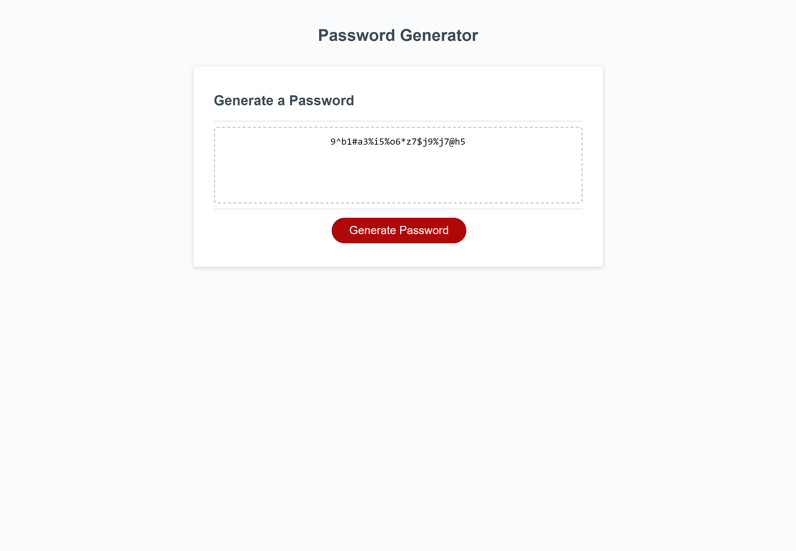

# Random Password Generator

This project generates a randomised password for user use, based upon user selected criteria.

## Motivation

This project was to showcase understanding of using javascript, and being able to apply it to create a password generator that could be used by anyone.

## Mock-UP

https://massicottec.github.io/password-roullette/

## Credits

    Chris Massicotte,
    Xandromus